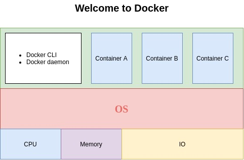

# Welcome to docker in action

## What is docker ? 

### Docker is a solution to solve common software problems, simplifying the processes related to the dev circle .

### Docker builds are isolated with respect to eight aspects.■
        PID namespace—Process identifiers and capabilities
        UTS namespace—Host and domain name
        MNT namespace—File system access and structure
        IPC namespace—Process communication over shared memory
        NET namespace—Network access and structure
        USR namespace—User names and identifiers
        chroot() —Controls the location of the file system root
        cgroups—Resource protection

# Docker compose!
### Docker-compose is intended for complex apps running on multiple containers.

                docker-compose start -> start a existing service container.
                docker-compose stop  -> stop command -t, --timeout
                docker-compose pause -> pause command
                docker-compose unpause -> unpause command
                docker-compose restart -> restart all containers/ or specific container
                docker-compose logs -> logs of all containers/ or specific container

### docker­-co­mpose version
        Prints the version of docker­-co­mpose.
### docker­-co­mpose push
        Pushes images for services to their respective regist­ry/­rep­ository
### docker­-co­mpose config
        Validate and view the Compose file
        
### docker­-co­mpose kill
        Forces running containers to stop by sending a SIGKILL signal.
### docker­-co­mpose bundle
        A Dockerfile can be built into an image, and containers can be created from that image. Similarly, a docker­-co­mpo­se.yml can be built into a distri­buted applic­ation bundle
### docker compose up -> 
        -f, --file, -d, --detach, --no-build,--forc­e-r­ecreate,--scale SERVIC­E=NUM

